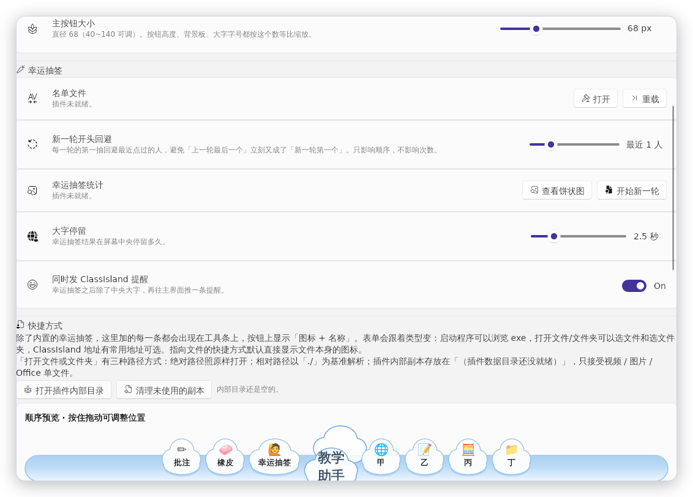

> **声明：这个插件是 DSH 写的，连这个 MD 也是（当然这句话是人写的）。**

<div align="center">

# 教学助手

**ClassIsland 的置顶工具条插件**

一个云朵圆钮，点开向两边展开 —— 幸运抽签、批注、快捷方式，都在手边。


[](../../releases/latest)
[](LICENSE)
[](#兼容性)

</div>

---

## 这是什么

一条常驻屏幕最顶层的悬浮工具条。不占地方、不抢焦点，需要的时候点一下展开，用完自己收回去。

主按钮是一朵云。点它，工具条向两边展开、云钮始终钉在原地居中，功能左右均分；**除了点主按钮和点具体功能，它不会自己收起来** —— 讲课时手滑碰到屏幕，不会莫名其妙缩回去。

内置幸运抽签和屏幕批注，另外可以自己加任意条快捷方式。

---

## 功能

### 公平幸运抽签

按名单抽人，算法是两层的：

1. **轮次完整性** —— 一轮之内每人恰好被抽到一次，抽完才开新一轮
2. **最少次数优先** —— 只在累计被抽次数最少的那一档人里抽

最后一步用系统熵源等概率取一个。另有「新一轮开头回避」，避免上一轮最后一个立刻又成了新一轮第一个。次数历史本地保存，右键可看饼状图。


### 屏幕批注

全屏手写，画在**所有窗口之上**，包括课件和视频。

- **软笔**六色，笔迹是平滑曲线不是折线，画完的笔画会缓存路径，攒到几百个点也不卡
- **橡皮**三档，加上一键清屏
- **退出后点击穿透** —— 画留着，鼠标还给系统，能直接点到下面的课件继续讲，不用先擦掉
- 打开批注时对应按钮会变暗，一眼看得出哪个功能正开着


### 自定义快捷方式

想放什么放什么，图标＋名称显示在工具条上。四类：

| 类型 | 用途 |
|---|---|
| 启动程序 / 命令 | 打开任意 exe、脚本，可带命令行参数，可勾选管理员运行 |
| 打开网址 | 用默认浏览器打开 |
| 打开文件或文件夹 | 见下方三种路径方式 |
| ClassIsland 地址 | 直接跳到应用设置、档案设置、主界面编辑模式等 |

**「打开文件」支持三种定位方式**，每条单独选：

- **绝对路径** —— 最简单，填什么开什么
- **相对路径（CI 内）** —— 相对于 ClassIsland 数据根目录。整个 ClassIsland 目录搬到别的盘、别的机器，路径依然对得上
- **插件内部副本** —— 把文件**复制一份**进插件自己的数据目录（只收视频 / 图片 / Office 单文件）。原文件在 U 盘上、在共享盘里、在别人电脑上都没关系

保存副本是**幂等**的：同样内容重复点不会越存越多。设置页里还给了一个「清理未使用的副本」，删掉快捷方式之后顺手把空间收回来。

指向文件的按钮**默认直接显示文件本身的图标**（走系统资源管理器那一套），也可以自己填 emoji。


### 顺序随便拖

内置功能和自定义快捷方式混在同一张顺序表里，设置页的预览里直接拖着换位置。



---

## 安装

1. 到 [Releases](../../releases/latest) 下载 `Toolbox-x.y.z.cipx`
2. 打开 ClassIsland →「应用设置」→「插件」→ 从文件安装，选中那个 `.cipx`
3. 重启 ClassIsland

要求 **ClassIsland 2.0.0.1 ~ 2.1.x**（API 版本 `2.0.0.0`）。

---

## 使用

| 操作 | 结果 |
|---|---|
| 左键点云钮 | 展开 / 收起 |
| 按住拖动 | 挪动工具条位置 |
| 右键 | 菜单（收起、主按钮大小、隐藏工具条） |
| 设置页 | 「应用设置 → 教学助手」里加功能、调大小和透明度、排顺序 |

透明度可以从 30% 调到 100% —— 讲课时工具条压在课件上，调低一点能看穿过去，又不像「隐藏」那样找不回来。

---

## 从源码构建

需要 **.NET 8 SDK**。

```bash
git clone https://github.com/githubyueshijiu/ClassIslandToolbox.git
cd ClassIslandToolbox

# 编译
dotnet build src/ClassIsland.Toolbox/ClassIsland.Toolbox.csproj -c Release

# 打包成可直接安装的 .cipx（产物在 src/ClassIsland.Toolbox/dist/）
./tools/pack.sh
```

> **如果 `dotnet restore` 报 `'N/A' is not a valid version string`**：环境里有个叫 `version` 的环境变量被 MSBuild 当成了版本号，先 `unset version` 再构建。`pack.sh` 里已经处理了这一点。

### 测试

`tests/TbTest` 是一个**无头 Avalonia** 的 UI 冒烟测试，132 项断言，会真的把工具条和设置页画一遍并截图到 `/tmp/tbshots`：

```bash
dotnet run --project tests/TbTest/TbTest.csproj -c Release
```

它编译的是**真实的插件源码**（不是引用 dll），只有宿主服务和拍照相关的东西用桩替掉了。覆盖了几何约束（展开后云钮是否真的居中、展开前后位置有没有跳、拖动和点击会不会互相误触发）、批注的起笔/擦除/清屏/退出保留、设置页拖动排序、以及「打开文件」三种路径方式的解析与控件显隐。

**它的价值在于抓那些肉眼容易放过的问题** —— 比如「展开时整条往上跳 166px」当初就是因为测试只断言了 X 坐标，补上 Y 断言之后同类问题立刻现形。

---

## 兼容性

| 平台 | 状态 |
|---|---|
| Windows | 完整支持（文件图标、置顶、批注点击穿透都是 Win32 行为） |
| Linux | 可用，置顶与托盘走 X11/D-Bus |
| macOS | 代码路径齐全，未实机验证 |

---

## 声明

### 作者

由 **秋夕月拾旧** 创作。

### 关于 AI

这个插件由 **DSH** 编写 —— 包括这份说明文档。代码在真实机器上编译、在无头 Avalonia 里跑过完整测试，但**没有在真机上做过长时间使用验证**。用在正式场合之前，建议自己先试一遍幸运抽签和批注。

### 致谢

这个项目由 **秋夕月拾旧** 独立完成。

开发过程中参考过下面这些项目，在此致谢：

- **[ClassIsland](https://github.com/ClassIsland/ClassIsland)** —— 插件框架、宿主 API、`.cipx` 打包约定，以及官方插件模板与 `ExamplePlugin`。
- **[RandomPicker](https://github.com/Gordonynh/RandomPicker)** —— 幸运抽签的抽选算法，以及统计窗口、中央大字窗口的实现思路，参考自这个项目。

### 许可

[MIT License](LICENSE) © 2026 秋夕月拾旧

用、改、再发布都可以，保留版权声明即可。使用的第三方组件遵循其各自协议：
ClassIsland.Core 与 Avalonia 均为 MIT。
